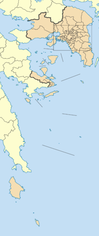

    

        

            

                

                    <h3 class="mt-0"> Digital Twins of Attica </h3>

                    

        The Digital Twin of the Attica region integrates innovations and pilots
        that different projects have implemented for climate adaptation. It aims
        to provide a tool to support climate adaptation efforts and improve the
        region's resilience against climate change's impacts.
      

      

        As a proof of concept, the Digital Twin of Attica will have several
        uses. It will support urban planning by simulating the impacts of
        extreme weather events and other climate change-related factors on the
        built environment and identifying the most vulnerable areas.
      

      

        As Attica is dependent on water resources, both for domestic consumption
        and agriculture, the Digital Twin will improve the efficiency of water
        usage and enhance the system's resilience against the impacts of climate
        change.
      

      

        The Digital Twin will provide flood risk assessment by simulating the
        impact of floods on particular areas, taking into account various
        factors such as rainfall, river flow, and land use. Through the Digital
        Twin, stakeholders will reduce the risk of flooding by improving
        drainage systems, increasing the elevation of buildings, and protecting
        critical infrastructures. Also, real-time monitoring of floods will
        allow stakeholders to respond quickly to emergencies and make informed
        decisions based on real-time information.
      

    

                

                

                    
                    
Attica (region). (2023, March 26). <a href="https://en.wikipedia.org/wiki/Attica_(region)">In Wikipedia.</a> 

                

            

        

    

